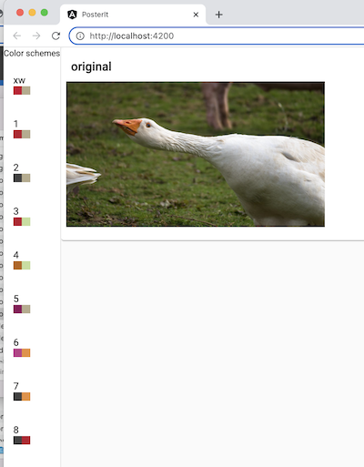
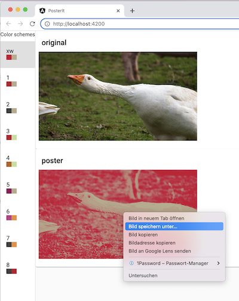

# Posterize
This is a simple tool to transform an image in the kreuzwerker style:

Turn this:


into this:


## Usage
You need NodeJs to be installed on your computer.

Run
```shell
% npm install
% npm run start
```
and point your web browser to  [http://localhost:4200/](`http://localhost:4200/`)

• drag an image to blue area or use the button to upload a file:

• now you can apply one of the provided presets on the left:

• save this image by right-clicking on it:


The image will be in same format and size as the original.

Currently JPEG and PNG files are supported.


This project was generated with [Angular CLI](https://github.com/angular/angular-cli) version 14.1.0.

